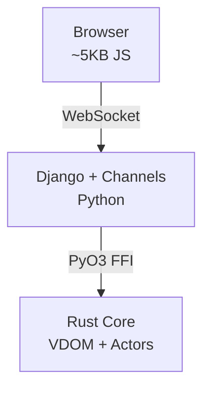

# Marketing Materials: Next Steps

**Action plan for implementing and improving the new marketing documents**

---

## Immediate Actions (This Week)

### 1. Update Main README.md

**Priority:** High
**Effort:** 30 minutes

**Action:**
- Copy content from `docs/README_MARKETING_SECTION.md` into main `README.md`
- Replace or augment existing content with new structure:
  - Hero section with badges at top
  - "Why djust?" section early
  - Quick comparison table
  - Performance benchmarks with visual charts
  - Updated Quick Start with clearer steps
  - Links to all new documentation

**Files to modify:**
- `README.md` (root)

---

### 2. Add GitHub Badges

**Priority:** High
**Effort:** 15 minutes

**Action:**
Add badges to top of README.md:

```markdown
[](https://pypi.org/project/djust/)
[](https://pypi.org/project/djust/)
[](https://www.djangoproject.com/)
[](LICENSE)
[](https://github.com/johnrtipton/djust/stargazers)
```

**Note:** Update URLs when repository goes public.

---

### 3. Cross-Link All Documents

**Priority:** High
**Effort:** 15 minutes

**Action:**
Ensure all documents link to each other appropriately:

**Add to README.md:**
```markdown
## Documentation

- **Getting Started**: [Quick Start Guide](QUICKSTART.md)
- **Marketing Overview**: [Why djust?](docs/MARKETING.md)
- **Framework Comparison**: [djust vs Alternatives](docs/FRAMEWORK_COMPARISON.md)
- **Technical Deep-Dive**: [Architecture & Performance](docs/TECHNICAL_PITCH.md)
- **Choosing the Right Tool**: [Why Not Alternatives?](docs/WHY_NOT_ALTERNATIVES.md)
- **State Management (Roadmap)**: [API Specification](docs/STATE_MANAGEMENT_API.md)
```

**Add footer to each marketing doc:**
```markdown
---

**Related Documentation:**
- [Marketing Overview](MARKETING.md) | [Framework Comparison](FRAMEWORK_COMPARISON.md) | [Technical Pitch](TECHNICAL_PITCH.md) | [Choosing Alternatives](WHY_NOT_ALTERNATIVES.md)
```

---

## Short-Term Actions (Next 2 Weeks)

### 4. Create Visual Assets

**Priority:** Medium
**Effort:** 2-4 hours

**Assets Needed:**

**A. Performance Benchmark Graphs**
- Template rendering comparison (bar chart)
- VDOM diffing comparison (bar chart)
- Concurrent user throughput (line graph)
- Bundle size comparison (bar chart)

**Tools:** matplotlib, plotly, or design tool (Figma, Canva)

**Location:** `docs/images/` or link to GitHub images

**Example:**
```python
# scripts/generate_benchmark_graphs.py
import matplotlib.pyplot as plt

frameworks = ['Django', 'django-unicorn', 'Tetra', 'djust']
render_times = [450, 450, 450, 12]  # ms for 10k items

plt.bar(frameworks, render_times)
plt.ylabel('Render Time (ms)')
plt.title('Template Rendering Performance (10,000 items)')
plt.savefig('docs/images/benchmark-rendering.png')
```

---

**B. Component Showcase Screenshots**
- Screenshot of demo project component showcase
- Individual component examples (modal, dropdown, table)
- Before/after code comparisons

**Tools:** Browser screenshots, annotate with arrows/highlights

---

**C. Architecture Diagrams**
- High-level system architecture (already ASCII in docs)
- Actor hierarchy visualization
- Message flow diagram

**Tools:** draw.io, mermaid.js, or Excalidraw

**Example (Mermaid in README):**
```markdown

```

---

### 5. Add Code Examples to Demo Project

**Priority:** Medium
**Effort:** 2-3 hours

**Action:**
Create example views matching marketing docs:

**Files to create:**
```
examples/demo_project/demo_app/views/
├── marketing_examples.py
│   ├── SimpleCounterView (from hero example)
│   ├── RealTimeSearchView (from use cases)
│   ├── LiveDashboardView (from use cases)
│   └── ChatRoomView (from use cases)
```

**Update urls.py:**
```python
urlpatterns = [
    path('examples/counter/', SimpleCounterView.as_view()),
    path('examples/search/', RealTimeSearchView.as_view()),
    path('examples/dashboard/', LiveDashboardView.as_view()),
    path('examples/chat/', ChatRoomView.as_view()),
]
```

**Purpose:** Visitors can immediately try the examples from marketing docs.

---

### 6. Create CONTRIBUTING.md

**Priority:** Medium
**Effort:** 1 hour

**Action:**
Add contribution guidelines mentioning marketing materials:

```markdown
# Contributing to djust

## Documentation Contributions

We welcome improvements to our documentation:

- **Marketing Materials**: `docs/MARKETING.md`, `FRAMEWORK_COMPARISON.md`, etc.
- **Technical Docs**: `CLAUDE.md`, `ACTOR_STATE_MANAGEMENT.md`, etc.
- **Examples**: Add real-world examples to `examples/demo_project/`

### Style Guide
- Use clear, concise language
- Include code examples
- Be honest about trade-offs
- Cross-link related docs
```

---

## Medium-Term Actions (Next Month)

### 7. Create Video Demo/Walkthrough

**Priority:** Medium
**Effort:** 4-6 hours

**Content:**
- 5-minute quick start demo
- 15-minute deep-dive walkthrough
- Component showcase tour
- Performance benchmark demonstration

**Platform:** YouTube, Vimeo, or embedded in docs

**Format:**
- Screen recording with voiceover
- Show live coding
- Demonstrate real-time updates
- Compare with alternatives (side-by-side)

---

### 8. Write Blog Posts

**Priority:** Medium
**Effort:** 2-3 hours per post

**Post Ideas:**

**A. "Introducing djust: Phoenix LiveView for Django"**
- Announce the project
- Explain the motivation
- Show quick example
- Link to docs

**B. "How We Achieved 100x Faster VDOM Diffing with Rust"**
- Technical deep-dive
- Benchmark methodology
- PyO3 integration details
- Lessons learned

**C. "Building a Real-Time Dashboard with djust"**
- Tutorial format
- Step-by-step guide
- Real-world use case
- Performance comparison

**D. "Why We Built djust Instead of Using X"**
- Honest comparison
- Design decisions
- Trade-offs considered
- When to use what

**Platforms:**
- Medium
- Dev.to
- Personal blog
- Django community forums

---

### 9. Submit to Showcases/Directories

**Priority:** Low-Medium
**Effort:** 2-3 hours total

**Directories to submit to:**

**Python/Django:**
- Django Packages (djangopackages.org)
- Awesome Django (GitHub awesome list)
- PyPI classifiers (update metadata)

**General:**
- Product Hunt
- Hacker News (Show HN)
- Reddit (r/django, r/python)
- Lobsters

**Timing:** Wait for v0.2.0 or when state management APIs are closer to completion.

---

### 10. Create Comparison Videos/Demos

**Priority:** Low
**Effort:** 6-8 hours

**Content:**
Side-by-side comparisons showing:
- djust vs django-unicorn (same feature, performance difference)
- djust vs HTMX (complexity vs structure trade-off)
- djust vs React (simplicity vs ecosystem)

**Format:**
- Split screen
- Same application built multiple ways
- Performance benchmarks live
- Code walkthrough

---

## Long-Term Actions (Next Quarter)

### 11. Community Building

**Priority:** Medium
**Effort:** Ongoing

**Actions:**

**A. GitHub Discussions**
- Create discussion categories:
  - Show and Tell (community projects)
  - Q&A (help forum)
  - Feature Requests
  - Performance Tips

**B. Discord/Slack Community**
- Consider creating community chat
- Help users get started
- Share updates and roadmap

**C. Newsletter**
- Monthly updates on progress
- Highlight community projects
- Share tips and tricks

---

### 12. Case Studies

**Priority:** Medium
**Effort:** 4-6 hours per case study

**Action:**
Document real-world usage:
- Interview early adopters
- Document their use case
- Measure actual performance gains
- Quote testimonials

**Format:**
```markdown
# Case Study: [Company Name]

## Challenge
- What problem they were solving
- What they tried before djust

## Solution
- How they implemented djust
- Code examples

## Results
- Performance improvements (concrete numbers)
- Development time saved
- Team feedback

## Quote
"[Testimonial from developer/CTO]"
```

---

### 13. Conference Talks/Workshops

**Priority:** Low (but high impact)
**Effort:** 10-20 hours per talk

**Conferences to target:**
- DjangoCon US/Europe
- PyCon US/Europe
- EuroPython
- Local Python/Django meetups

**Talk Ideas:**
- "Phoenix LiveView Architecture in Python"
- "Building Real-Time Dashboards with Django"
- "Zero-GIL Concurrency with Rust and Python"

---

### 14. SEO Optimization

**Priority:** Low-Medium
**Effort:** 2-3 hours

**Actions:**

**A. Optimize Documentation Pages**
```markdown
<!-- Add to each doc -->
---
title: djust: Phoenix LiveView for Django | Performance Comparison
description: Compare djust with django-unicorn, HTMX, Phoenix LiveView, and React. See why djust is 10-100x faster for Django real-time applications.
keywords: django liveview, django websocket, django real-time, phoenix liveview python, htmx alternative, django unicorn alternative
---
```

**B. Create Structured Data**
```html
<script type="application/ld+json">
{
  "@context": "https://schema.org",
  "@type": "SoftwareApplication",
  "name": "djust",
  "description": "Phoenix LiveView for Django, powered by Rust",
  "applicationCategory": "WebApplication",
  "operatingSystem": "Cross-platform",
  "offers": {
    "@type": "Offer",
    "price": "0"
  }
}
</script>
```

**C. Target Keywords**
- "Django LiveView"
- "Phoenix LiveView Python"
- "Django reactive components"
- "Django WebSocket real-time"
- "HTMX alternative"
- "django-unicorn alternative"

---

## Maintenance Actions (Ongoing)

### 15. Keep Documentation Updated

**Priority:** High
**Effort:** 30 min per release

**Action:**
When releasing new features:
1. Update MARKETING.md with new capabilities
2. Update FRAMEWORK_COMPARISON.md if competitive landscape changes
3. Update benchmarks if performance improves
4. Move roadmap items from "Coming Soon" to "Available"
5. Add new code examples

**Template for updates:**
```markdown
## Changelog Entry

### Version X.Y.Z (Date)

**New Features:**
- Feature description
- Updated benchmark: X → Y (improvement)
- New example: [link]

**Documentation Updates:**
- Updated MARKETING.md §3.2
- Added comparison in FRAMEWORK_COMPARISON.md
- New code examples in demo project
```

---

### 16. Monitor and Respond

**Priority:** Medium
**Effort:** 1-2 hours/week

**Actions:**

**A. GitHub Issues/Discussions**
- Respond to questions within 24-48 hours
- Link to relevant documentation
- Update docs if same question asked repeatedly

**B. Social Media Mentions**
- Google Alerts for "djust django"
- Twitter/X search for mentions
- Reddit monitoring (r/django)
- Respond to comparisons/discussions

**C. Analytics**
- Track documentation page views
- Monitor GitHub stars/forks growth
- Track PyPI download stats
- Identify most popular docs (focus there)

---

## Success Metrics

**Track these to measure marketing effectiveness:**

### GitHub Metrics
- ⭐ Stars: Target 100 by end of Q1, 500 by end of year
- 🍴 Forks: Target 20 by end of Q1, 100 by end of year
- 👁️ Watchers: Track growth
- 💬 Issues/Discussions: Active community engagement

### PyPI Metrics
- 📦 Downloads: Track weekly/monthly growth
- 📈 Trend: Compare with django-unicorn, Tetra

### Documentation Metrics
- 👀 Page views (if tracked via analytics)
- 🔗 Inbound links (SEO backlinks)
- 📱 Social shares

### Community Metrics
- 💬 Discussion activity
- 🤝 Contributors (docs + code)
- 📝 Community blog posts/tutorials
- 🎤 Conference talks mentioning djust

---

## Priority Summary

### Do Now (This Week)
1. ✅ Update README.md with new content
2. ✅ Add GitHub badges
3. ✅ Cross-link all documents

### Do Soon (Next 2 Weeks)
4. Create visual assets (charts, screenshots)
5. Add marketing example views to demo project
6. Create CONTRIBUTING.md

### Do Eventually (Next Month+)
7. Video demo/walkthrough
8. Blog posts
9. Submit to directories
10. Comparison videos

### Ongoing
- Keep docs updated
- Monitor and respond
- Track metrics
- Build community

---

## Resources Needed

**Time Investment:**
- Immediate (this week): 1-2 hours
- Short-term (2 weeks): 6-10 hours
- Medium-term (1 month): 15-25 hours
- Long-term (ongoing): 2-5 hours/week

**Skills Needed:**
- Writing: Documentation updates
- Design: Visual assets (or hire designer)
- Video: Screen recording/editing (or hire editor)
- Marketing: SEO, community management

**Tools:**
- GitHub (documentation hosting)
- Matplotlib/Plotly (benchmark charts)
- Figma/Canva (design assets)
- OBS Studio (video recording - free)
- YouTube (video hosting - free)

---

## Questions to Answer

Before implementing, decide:

1. **README.md**: Full replacement or augment existing?
2. **Badges**: Which metrics to show (stars, downloads, etc.)?
3. **Visual assets**: Create now or wait for community?
4. **Video**: DIY or hire professional?
5. **Blog**: Where to publish (Medium, personal blog, both)?
6. **Community**: Discord/Slack or just GitHub Discussions?
7. **Case studies**: Wait for organic adoption or reach out?

---

## Summary

**Phase 1 (Week 1):** Documentation updates
**Phase 2 (Weeks 2-3):** Visual assets + examples
**Phase 3 (Month 1):** Content creation (blog, video)
**Phase 4 (Ongoing):** Community building + maintenance

**Total estimated time:** 40-60 hours initial investment, then 2-5 hours/week ongoing.

**Expected outcome:**
- Professional, comprehensive documentation
- Clear positioning vs alternatives
- Increased GitHub stars and community engagement
- PyPI download growth
- Production adoption from early users

---

**Ready to launch? Start with updating README.md today!** ✅
