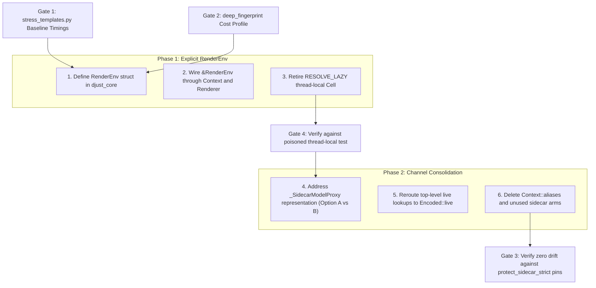

# ADR-029: Consolidate Value Boundary Channels and Explicit RenderEnv

**Status**: Draft / Gated Proposal
**Date**: 2026-09-09
**Citations**: `file:line` references pinned to `main` at `2dc61307` and `docs/value-boundary-map` at `1c4b9b35`
**Deciders**: Project maintainers
**Related**:
- [ADR-027](027-template-variable-resolution-follows-django.md) — live handle (`Encoded::live`) at one sink; eager model normalization
- [ADR-024](024-template-callable-auto-call.md) — callable auto-calling rules
- [ADR-022](022-v1.1-code-quality-single-path-convergence.md) — single-path convergence
- `docs/architecture/VALUE_BOUNDARY.md` — value boundary map and false-claim catalog
- `docs/SECURE_DEFAULTS.md` — serialization floor authority (`_attr_is_serializable`, `protect_sidecar_strict`)
- Issues/PRs: #1986, #2142, #2375, #2448, #2501, #2504, #2717, #2728, #2731, #2732, #2733, #2734, #2737, #2742, #2743, #2744

---

## 1. Summary

`djust`'s value boundary currently operates two parallel live-object mechanisms:
1. The **ADR-027 live handle** (`Encoded::live`, `crates/djust_core/src/lib.rs:719`), carried inside the converted value.
2. The **by-name raw-Python sidecar** (`Context.raw_py_objects`, `crates/djust_core/src/context.rs:292`), keyed by top-level name and tracked through `Context::aliases` (`#2375`).

This duality creates a verified shadowing trap (`VALUE_BOUNDARY.md` §6.1): bare rebindings and top-level expressions resolve via the sidecar even when the live handle is gated off, making un-isolated tests vacuous. In addition, ambient render settings (`RESOLVE_LAZY`, timezone, decimal formats) rely on a thread-local `Cell<bool>` (`lib.rs:2821`), requiring a per-render synchronization chokepoint before dispatch across worker threads.

This ADR drafts the consolidation of the value boundary onto:
1. **A single live channel**: retiring the by-name sidecar and alias bookkeeping in favor of the by-value handle, while explicitly resolving the model proxy contract (`_SidecarModelProxy`).
2. **An explicit `RenderEnv`**: replacing the ambient thread-local with an explicit environment struct passed into conversion and rendering.

Every step in this ADR is subject to **four mandatory gating criteria** to prevent unmeasured claims and regression of closed security defects.

---

## 2. The Four Mandatory Gates

The value boundary is historically prone to false absolutes and unverified performance assertions. No implementation PR for this ADR may land without passing each gate:

### Gate 1: Benchmarked Cost Verification via `stress_templates.py`
* Every claim of "conversion tax" or "performance gain" must be accompanied by median and min timings from `benchmarks/stress_templates.py` against a release build (`_refuse_a_debug_build()`).
* **Prior False Claim**: It is easy to assert that converting values eagerly is a major bottleneck. However, the #2737 investigation demonstrated that lazy resolution *already shipped* in ADR-027. The actual measured bottlenecks were:
  - The per-loop-entry scope clone (fixed in #2732 / #2733).
  - The state clone (PR #2744 — approved, pending merge at time of writing).
* The primary remaining conversion cost is **datetime pre-collection** (~70% of conversion time on realistic pages). Any proposal to make datetime collection lazy must explicitly account for `temporal_kind` dispatching on the `attrs` map and the four render-time readers that depend on it.

### Gate 2: The Change-Detection Floor (`deep_fingerprint`)
* Any architectural claim that "Rust-side laziness makes unread context variables free" is **formally rejected**.
* **The Reality**: Python-side change detection (`deep_fingerprint`, `python/djust/change_detection.py:90`) executes $O(\text{total context})$ work per event — measured at **1.9 ms for 5,000 objects** — walking the entire context *before* Rust conversion ever occurs.
* Because Python already pays to inspect every key, identity, and container structure for change detection, making Rust conversion lazy cannot eliminate the baseline overhead of unread context objects. Feasibility and throughput boundaries are bounded by `deep_fingerprint`, not PyO3 conversion.

### Gate 3: Preservation of the Single Floor Authority (`protect_sidecar_strict`)
* A proposal must **not** introduce a secondary, name-based, or Python-side filtering mechanism (e.g. ad-hoc `denylist: set[str]` helpers).
* **The Closed Defect**: The #2734 convergence established that serialization floor enforcement has **one authority**:
  - Python: `djust.serialization._attr_is_serializable` (called by `_SidecarModelProxy.__getattr__`).
  - Rust: the free function `protect_sidecar_strict` (`crates/djust_core/src/context.rs:114`). The `Context` method of the same name at `:2077` only delegates to it (`:2082`); `walk_live` calls that method at `:2314` and `:2329`.
* Introducing a separate Python dotted-lookup helper bypasses `_attr_is_serializable` and reopens the exact vulnerability class closed in FINDING-14, FINDING-15, and #2734.
* **GIL "Ping-Pong" Refuted**: The claim that segment-by-segment `Python::attach` in `walk_live` causes severe GIL contention is unmeasured and largely false on the default path: `sync_to_async` holds the GIL across the render, making `Python::attach` an inexpensive reentrant check rather than a thread synchronization acquisition.

### Gate 4: Thread-Local Characterization (Smell vs. Hazard)
* The `RESOLVE_LAZY` thread-local is a **design smell**, verified **not an active bug**.
* The 28 render dispatches in `python/djust/runtime.py` do not manage the thread-local individually. Instead, `_sync_state_to_rust` routes through a single per-render chokepoint:
  `self._apply_render_env()` (`python/djust/mixins/rust_bridge.py:657`).
* In the #2743 review verification, the config was set to `False` and the thread-local was deliberately poisoned to `True`: a real render across `sync_to_async(thread_sensitive=True)` properly returned the flag-off answer and left the thread-local `False`.
* Replacing the thread-local with an explicit `RenderEnv` is justified on architectural cleanliness grounds (eliminating ambient state), not as an emergency bug fix.

---

## 3. Decision

### 3.1 Consolidating the Two Live Channels

#### Current State
Today, `Context::resolve_without_builtins` (`crates/djust_core/src/context.rs:1755`) checks:
1. `walk_from_handle` (`:1800`) — reads `Encoded::live`.
2. `self.get` (`:1805`) — inert value stack.
3. `self.dict_view` (`:1822`) — `.items`, `.keys`, `.values`.
4. `self.string_index` (`:1831`) — `.0`.
5. `raw_py_objects` (`:1834`) — the raw-Python sidecar, using `Context::aliases` (`:1873`).

#### The Problem: Shadowing and Test Isolation
Because arm 5 answers lookups for bare aliases (``) and top-level variables, disabling `resolve_lazy` on an un-isolated template produces a false negative: the lookup succeeds through arm 5. Tests must use filtered operands (``) or dict views to force arm 1.

#### The Model Contract Challenge
Retiring the sidecar is **not low-risk** without resolving the Django model contract:
* Under ADR-027 (b)(1), Django models, managers, and querysets **deliberately do not get handles**. They convert to floored dicts (`_normalize_db_values`, `normalize_django_value`) so that sensitive fields (`password`) cannot be dumped.
* When a template calls a model method (`{{ user.get_full_name }}`), the value stack has only a floored dict. Currently, this miss falls through to arm 5, where the sidecar provides a `_SidecarModelProxy(user)`.
* If arm 5 is removed, models must either:
  - **Option A (Proxy Handle)**: Allow models to cross as an `Encoded` carrying an explicit `_SidecarModelProxy` in `Encoded::live`, while maintaining the floored dict as the inert representation.
  - **Option B (Retain Targeted Model Sidecar)**: Restrict `raw_py_objects` exclusively to `_SidecarModelProxy` instances and remove all container descent, aliases, and non-model fallback logic.

*Decision*: Option A is the target architecture. Option B is an acceptable intermediate step if Option A threatens the serialization floor pins.

### 3.2 Replacing Thread-Locals with Explicit `RenderEnv`

#### Current State
`crates/djust_core/src/lib.rs:2821`:
```rust
static RESOLVE_LAZY: std::cell::Cell<bool> = const { std::cell::Cell::new(true) };
```
This ambient variable is read at 8 functional sites across `djust_core` and `djust_templates` (`VALUE_BOUNDARY.md` §5.4). It was placed in a thread-local because PyO3's `FromPyObject::extract` trait does not accept contextual parameters.

#### Target State
1. Introduce an explicit `RenderEnv` in `djust_core`:
   ```rust
   #[derive(Clone, Debug)]
   pub struct RenderEnv {
       pub resolve_lazy: bool,
       pub timezone: Option<String>,
       pub number_format: Option<NumberFormatConfig>,
   }
   ```
2. Decouple conversion from the orphan `FromPyObject` trait for context ingestion:
   ```rust
   impl Value {
       pub fn from_py_with_env(ob: &Bound<'_, PyAny>, env: &RenderEnv) -> PyResult<Self> { ... }
   }
   ```
3. Pass `&RenderEnv` through `Context::new`, `render_template`, and `render_nodes_partial`.
4. Deprecate `djust_core::set_resolve_lazy` and `djust_core::resolve_lazy()`.

---

## 4. Sequencing & Migration

Implementation must proceed in strict phases, governed by the four gates:



### Phase 1: Explicit `RenderEnv` Injection
1. Add `RenderEnv` to `djust_core`.
2. Update `Context` and `render_nodes_partial` to accept `&RenderEnv`.
3. Eliminate `RESOLVE_LAZY` and the `_apply_render_env` push mechanism.
4. Verify that the 28 render dispatches pass all existing tests without ambient synchronization.

### Phase 2: Channel Consolidation
1. Resolve the `_SidecarModelProxy` contract: ensure model method lookups have a single, safe, verified path.
2. Route all live lookups through `walk_from_handle`.
3. Delete `Context::aliases` (#2375) and reduce `Context::resolve_without_builtins` from 5 arms to 3.
4. Verify that `TestFilteredAndDictViewOperands2504` and `TestTheSerializationFloorHoldsOnTheNewHandle` stay green without requiring isolating bindings.

---

## 5. Non-Goals and Explicit Exclusions

1. **No Ad-Hoc Python Dotted Resolvers**: Multi-segment lookups will remain in Rust's `walk_live`, re-applying `protect_sidecar_strict` at each segment. No separate Python helper with custom denylists will be introduced.
2. **No Claim of Free Context Objects**: We do not claim that lazy conversion avoids context overhead, as `deep_fingerprint` remains $O(\text{context})$.
3. **No Breaking of the Serialization Floor**: Models will never be bulk-dumped into `Value::Object` or traversed without `protect_sidecar_strict`.

---

## 6. Verification & Test Strategy

- **Security Pins**: Must maintain green status on `python/tests/test_sized_sequence_conversion_2695_2693.py:775` (`TestTheSerializationFloorHoldsOnTheNewHandle`) and `crates/djust_core/tests/test_django_lookup_sink_2539.rs`.
- **Wire Safety**: Verify `TestTheHandleNeverReachesTheWire2539` continues to pass (handles remain strictly transient).
- **Performance**: Benchmark `benchmarks/stress_templates.py` before and after each phase to ensure no regression in render throughput.
