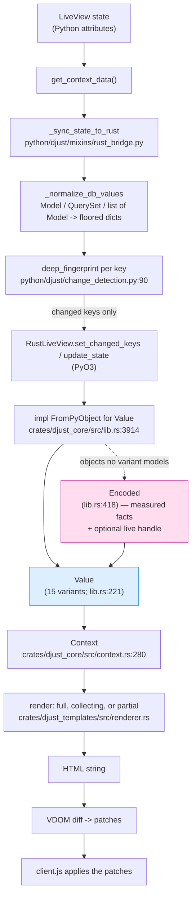
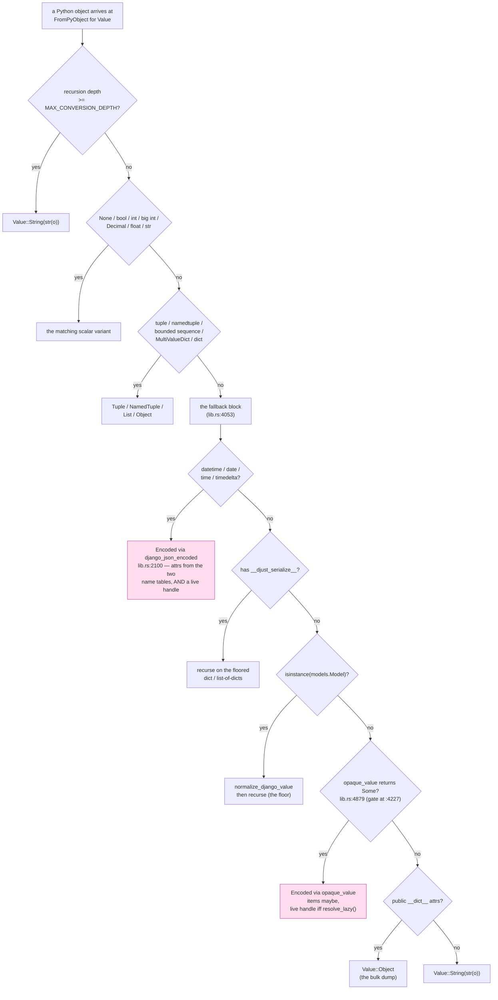
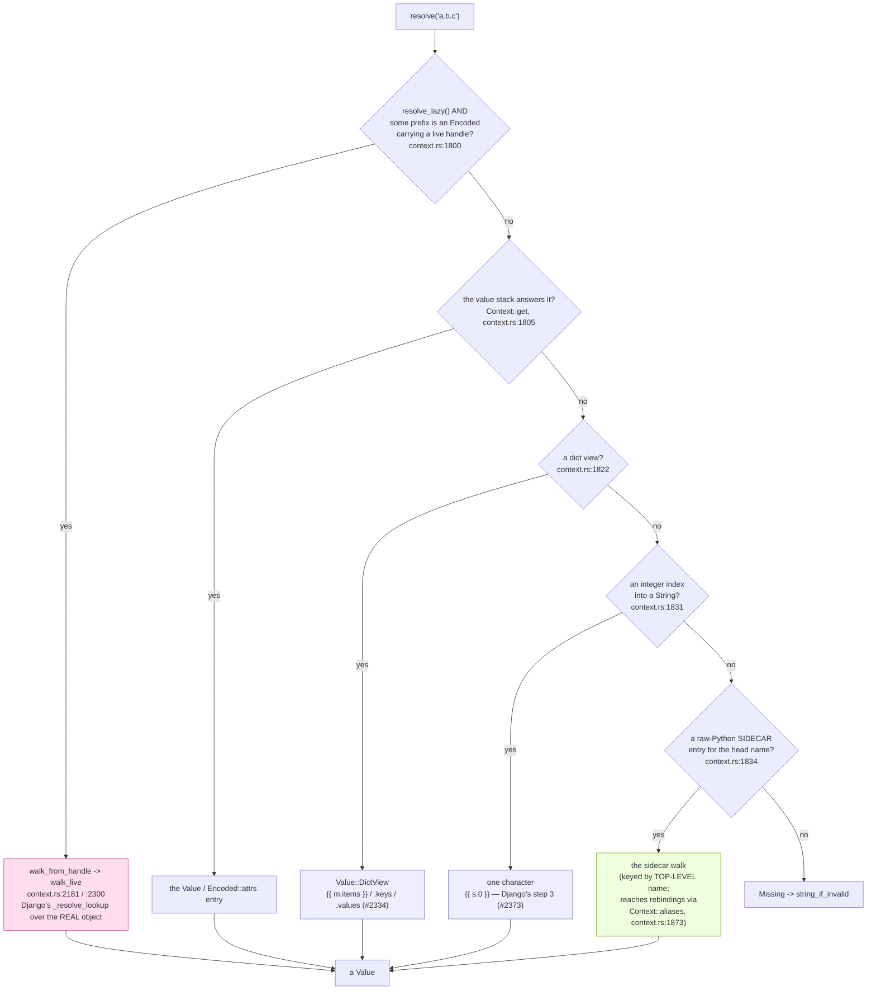
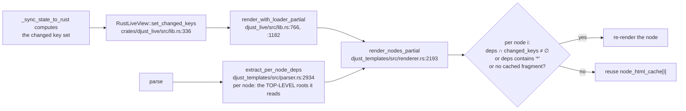

# The value boundary: how a Python value becomes rendered output

How a value in a `LiveView`'s state crosses into Rust, what shape it takes on
the other side, how a template lookup is answered, and how the result gets back
to the browser.

Read top-down and stop when you have what you need. Section 1 is the picture,
section 2 is the story, section 3 is the mechanism with line numbers, section 4
is the invariants and the tests that pin them, section 5 is threading and the
GIL. Section 6 records exactly which claims in this document were verified by
running code and which were not.

> **Why this document exists.** In one session, nine separate claims about this
> boundary — in shipped Rust doc comments, in `CLAUDE.md`, in issue bodies and
> in PR descriptions — turned out to be false. Every one of them was an
> *absolute*: "never", "always", "cannot", "the only". The machinery that was
> undocumented and the machinery that attracted false claims are the same
> machinery. So every absolute below was falsification-tested by constructing
> the case that would disprove it and running it; section 6 says which, and
> names the ones that were not.
>
> The first version of this document then shipped a **tenth**, by citing a
> shipped doc comment instead of running the case (§6.9). It is recorded rather
> than quietly fixed, because it is the sharpest available evidence for the rule
> this document exists to carry: **a doc comment is not evidence.**

---

## 1. The picture

### 1.1 End to end



### 1.2 Which carrier does a Python object become?

The order below **is** the code's order, and the order is load-bearing: several
arms are only correct because an earlier one already claimed the type.
(`crates/djust_core/src/lib.rs:3914`–`4168`.)



Under the shipped default (`resolve_lazy()` is `true`), `opaque_gate`'s last
decline is lifted, so the `Value::Object` bulk-dump arm is reached only when
`opaque_value` returns `None`. That happens when a probe on the object raises:
`bool(o)`, `str(o)`, `repr(o)` or `type(o).__name__` — **or, and this is the
one that is easy to miss, a failure while ENUMERATING the items** (`item.is_err()`
at `lib.rs:4302`, and `item.ok()?` / `extract::<Value>().ok()?` in
`opaque_value`). `iter(o)` *failing* is not on that list: `try_iter().ok()`
just sets `iterable = false`, which is the ordinary non-iterable case — and a
non-iterable object does get a handle. Both halves measured in §6.6.

### 1.3 How `{{ a.b.c }}` is answered

**Five** arms, tried in this order, in `Context::resolve_without_builtins`
(`crates/djust_core/src/context.rs:1755`). Two of them reach live Python; those
two are **different mechanisms**, and conflating them is how a gate-off test
becomes vacuous (§6.1). The middle two are neither, and are easy to mistake for
the sidecar — the code spends twenty lines (`context.rs:1808`–`1830`) on why
they sit between `get` and the sidecar guard.



The two middle arms are genuinely reachable and are neither the handle nor the
sidecar — measured, because an earlier draft of this section drew three arms and
a reader would have concluded `{{ m.items }}` is a sidecar answer:

| template | context | renders |
|---|---|---|
| `{{ m.items }}` | `{"a": 1}` | `dict_items([('a', 1)])` |
| `{{ s.0 }}` | `"abc"` | `a` |
| `{{ t.1 }}` | `["abc"]` | `b` |

The third is the proof: a *filtered* binding, so the sidecar cannot reach it
(§6.1), and the value stack cannot answer `.1` on a `String` — and it renders
`b` with the handle flag both on and off, so it is not the handle either.

### 1.4 The partial-render dependency path



---

## 2. The narrative

djust's boundary is not "Python objects go to Rust". It is closer to the
opposite: **almost nothing crosses as itself.** At the boundary, every context
value is *measured* — its `str()`, its `repr()`, its truthiness, its length, its
Django-JSON spelling, its comparison key — and it is those measurements that
cross, as an inert `Value` (`crates/djust_core/src/lib.rs:221`). The render
engine is a pure Rust program over inert data, and it can produce most of a page
without ever touching the interpreter.

That works right up until a template asks something the measurements cannot
answer. `{{ post.published.year }}` needs an attribute; `{{ obj.get_label }}`
needs a call; `{{ d.resolution }}` needs a class attribute nobody thought to
measure. Django's `Variable._resolve_lookup` answers all of these against the
live object, and reproducing it over inert data is not possible in general — you
cannot enumerate an arbitrary object's attributes ahead of time without walking
its `__dict__` into a queryset and down through *its* `__dict__` until the stack
overflows, which is exactly what an earlier version did.

So the boundary is porous in one specific, bounded way: a converted value may
carry a **live handle** — a refcount on the original Python object
(`Encoded::live`, `lib.rs:719`) — and a dotted lookup that the inert data cannot
answer walks that handle back into Python, one segment at a time, applying
Django's exact rules and re-applying djust's serialization floor after every
step. This is ADR-027. The handle rides *inside* the value rather than beside it
by name, which is what makes it survive `` and
`` — the older by-name sidecar could not (#2504, #2505, #2542).

Three things stay deliberately eager, and each for a stated reason
(ADR-027 (b)): Django **models, managers and querysets** become floored dicts
before they ever reach the conversion, because the client needs a JSON shape, a
rolling deploy needs msgpack compatibility, and the serialization floor needs a
materialised form; **containers and scalars** (`dict`, `list`, `tuple`, `set`,
`Decimal`, `datetime`, `bytes`) keep the variants they already had; and a
**list of models** is served by the JIT channel and stays there.

Getting back out is the mirror image. The rendered HTML is diffed against the
previous render, and only the patches travel. On the way *in*, the same economy
applies one level up: Python fingerprints each context key
(`deep_fingerprint`, `python/djust/change_detection.py:90`) and hands Rust only
the keys whose fingerprint moved; Rust intersects that key set with each
template node's statically-extracted dependency set and re-renders only the
nodes that overlap. Change detection therefore happens **on the Python side of
the boundary**, before conversion — which is why it compares Python objects, not
`Value`s.

---

## 3. The mechanism

Every `file:line` below was grepped at the commit this document was written
against. If a line has drifted, grep the symbol name — the names are stable, the
numbers are not.

### 3.1 The stages

| # | stage | where |
|---|---|---|
| 1 | Gather state | `LiveView.get_context_data()` |
| 2 | Normalize DB values | `_normalize_db_values`, `python/djust/mixins/rust_bridge.py:83` |
| 3 | Detect change | `deep_fingerprint`, `python/djust/change_detection.py:90` |
| 4 | Hand across (PyO3) | `RustLiveView::set_changed_keys`, `crates/djust_live/src/lib.rs:336` |
| 5 | Convert | `impl FromPyObject for Value`, `crates/djust_core/src/lib.rs:3914` |
| 6 | Bind | `Context`, `crates/djust_core/src/context.rs:280` |
| 7 | Resolve | `Context::resolve_without_builtins`, `context.rs:1755` |
| 8 | Render | `render_nodes_partial` / `render_nodes_collecting`, `crates/djust_templates/src/renderer.rs:2193` / `:2173` |
| 9 | Diff and send | VDOM patches → `client.js` |

### 3.2 The types

**`Value`** (`crates/djust_core/src/lib.rs:221`) — the inert carrier. **Fifteen**
variants: `Missing`, `None`, `Bool`, `Integer`, `Float`, `String`, `SafeString`,
`List`, `Tuple`, `NamedTuple`, `Object`, `DictView` (`:298`), `Decimal`,
`BigInt`, `Encoded`.

`Missing` is *not* Python's `None`: an absent key arrives as `Option::None` from
the resolver and `Missing` is what `string_if_invalid` substitutes. `DictView`
is the carrier §1.3's third arm produces — `{{ m.items }}` / `.keys` /
`.values` (#2334), with `DictViewKind` (`:203`) recording which of the three.

**`Encoded`** (`crates/djust_core/src/lib.rs:418`) — the carrier for a Python
object that no other variant models. It holds the facts measured at conversion:

| field | line | what it is |
|---|---|---|
| `type_name` | `:422` | CPython's `tp_name`, as a `TypeError` spells it |
| `display` | `:425` | `str(o)` — what `{{ p }}` renders |
| `display_safe` | `:427` | whether `str(o)` is `SafeData`; never restored from the wire |
| `json` | `:429` | `DjangoJSONEncoder.default(o)` |
| `truthy` | `:432` | `bool(o)` — Python's own answer, not a Rust guess |
| `len` | `:462` | `len(o)`, or `None` where Python raises |
| `iterable` | `:484` | `iter(o)` succeeded |
| `repr` | `:500` | `repr(o)`, measured rather than copied from `display` (#2472) |
| `cmp_key` | `:504` | Python's ordering key, for `` |
| `attrs` | `:551` | the named attributes reached by a dotted lookup, see §3.3 |
| `items` | `:589` | `list(o)`, enumerated at conversion — or `None`, see §3.5 |
| `eq_class` | `:640` | which of Python's equality contracts this value obeys |
| `live` | `:719` | **the live handle** — `Arc<Py<PyAny>>`, see §3.4 |

The handle is transient: not serialized (the `ENCODED_TAG` wire payload stays
eleven slots), not compared by `PartialEq for Encoded` (`:955`), dropped by a
msgpack round trip, re-attached on every render.

### 3.3 `Encoded::attrs` and the two name tables

A `datetime` is a C type with no `__dict__`, so no bulk dump can reach `.year`.
Two constant tables state the whole policy:

- **`ENCODED_ATTR_NAMES`** (`lib.rs:764`) — *data* attributes, per `tp_name`.
  `datetime.datetime` → `year month day hour minute second microsecond fold
  tzinfo convert_to_local_time`; `datetime.date` → `year month day`;
  `datetime.time` → `hour minute second microsecond fold tzinfo`;
  `datetime.timedelta` → `days seconds microseconds`.
- **`ENCODED_CALL_NAMES`** (`lib.rs:850`) — *nullary methods*, which Django
  reaches through its auto-call (ADR-024). `datetime.datetime` → `isoformat
  ctime weekday isoweekday toordinal timestamp utcoffset tzname dst`, and
  shorter lists for the others.

Both are merged into the same `attrs` map by `django_json_encoded`
(built at `lib.rs:2197`, second table merged in at `:2210`) so
`lookup_segment` (`context.rs:134`) stays the one
reader. `min` / `max` / `resolution` are deliberately in **neither** table: their
values are themselves `datetime`s and `datetime.min.min is datetime.min`, so
collecting them would not terminate (`lib.rs:520`–`534`).

They render anyway — through the live handle. See §6.2.

### 3.4 The live handle: who gets one

Two functions build an `Encoded` **at the Python→Rust conversion**, and they
attach the handle differently. (Seven further sites — `lib.rs:1655`, `:1718`,
`:1773`, `:1825`, `:1881`, `:1939`, `:1988` — reconstruct one from an
`ENCODED_TAG` wire payload rather than from a live object, and every one of them
sets `live: None`. That is the handle's transience, mechanically: nothing
restored from state can carry one.)

**`opaque_value`** (`lib.rs:4879`) — the general carrier. It attaches a handle
**iff** the thread-local flag is on (`lib.rs:4935`–`4916`):

```rust
let lazy = resolve_lazy();
let live = if lazy { Some(std::sync::Arc::new(ob.clone().unbind())) } else { None };
```

Attaching costs no Python call: `Bound::unbind` is a refcount bump plus an `Arc`
allocation.

**`django_json_encoded`** (`lib.rs:2100`) — the datetime family. It attaches a
handle **unconditionally** (`lib.rs:2236`):

```rust
live: Some(std::sync::Arc::new(ob.clone().unbind())),
```

There is no `resolve_lazy()` guard on that line. The behaviour is still gated,
because the *sink* is gated (`context.rs:1800`) — but the field is populated
either way. See §6.3.

**Who does not get one.** The arms *above* `opaque_value` in the fallback block
claim their types first, so nothing they claim can reach the handle: a `dict`, a
`tuple`, a `list`, a `NamedTuple`, a `MultiValueDict`, anything with
`__djust_serialize__` (`lib.rs:4078`), and any `models.Model` (`lib.rs:4113`).
That last pair is the serialization floor: routing a model through the
`__dict__` bulk dump would filter only `_`-prefixed keys and leak `password`.
ADR-027 states it as an explicit non-goal: *"`Value::Object` never carries a
handle."*

**The sink.** `walk_from_handle` (`context.rs:2181`) tries the **longest**
resolvable prefix first, so for `{{ p.child.name }}` where both `p` and
`p.child` carry a handle the walk starts at `p.child` and asks Python for one
segment instead of two. It then calls `walk_live` (`context.rs:2300`), which is
Django's `_resolve_lookup` transcribed: the callable block (`maybe_call`,
`context.rs:2089`) for the root bit, then per segment `walk_one_segment`
(`context.rs:2341`) — dict item, attribute, integer index, each with Django's
catch set — with `protect_sidecar_strict` (`context.rs:2077`) re-applying the
serialization floor to the root before the loop (`context.rs:2314`) and again
after each segment (`:2329`).

### 3.5 Where `OPAQUE_ITEM_CAP` actually governs

`OPAQUE_ITEM_CAP = 100_000` (`lib.rs:4183`). Its primary job is **whether the
items are enumerated at conversion time**. It does *not* gate the live handle,
and it does not gate whether an object gets an `Encoded` at all — those are the
two things it is most often assumed to do (§6.4).

It is not *only* about enumeration, though: the same threshold feeds
`stated_len_is_too_large_to_enumerate` (`lib.rs:3666`) and
`Encoded::list_repr_is_this_objects_own_spelling` (`lib.rs:3819`), so it also
participates in how a declined container is *spelled*. Both of those reads are
themselves `resolve_lazy()`-conditional.

`opaque_gate` (`lib.rs:4227`) measures four facts without converting anything —
`truthy`, `len`, `iterable`, `unbounded` — and sets `unbounded` when either
axis passes the cap:

- a **sized** object whose stated `__len__` exceeds it
  (`stated_len_is_too_large_to_enumerate`, `lib.rs:3665`; the check is at
  `lib.rs:4295`);
- an **unsized** iterable whose walk passes it (`lib.rs:4306`).

`opaque_value` then leaves `items: None` for an unbounded object, for a one-shot
iterator (`iter(o) is o` — reading it at conversion would consume the caller's
object), and for a non-iterable. The *sinks* read such an object through the
handle instead — `Encoded::consume_live_items` (`lib.rs:4411`) for ``,
`Encoded::declined_list_spelling` (`lib.rs:4470`) for `{{ v }}` / `pprint` /
`json_script` — under their own termination rule,
`Encoded::live_walk_terminates` (`lib.rs:4388`).

The intent is that rendered output not depend on which side of the cap a value
falls — the work moves from the conversion to the sink, and #2717 exists because
an earlier exemption broke exactly that. What was **measured** here is narrower
than the intent: `` over a duck-typed iterable that *states* a length
past the cap produced byte-identical output to the same iterable under it
(§6.4). That is one shape over one sink; treat the general claim as the design's
goal, pinned by `test_declined_container_spelling_2717.py`, not as something
this document measured.

On the eager escape hatch (`resolve_lazy()` false) there is no handle to read
later, so an unbounded object is *declined* by the gate instead and falls to
`Value::String(str(o))`.

### 3.6 What is deliberately eager

Per ADR-027 (b) (`docs/adr/027-template-variable-resolution-follows-django.md:227`):

1. **Django models, managers, querysets** — a floored dict as the value, with a
   by-name proxied handle for misses. Four reasons are given: the client's JSON
   shape, msgpack rolling-deploy compatibility, container `!=` change detection,
   and the floor's materialised form. On the LiveView path the normalization is
   `_normalize_db_values` (`python/djust/mixins/rust_bridge.py:83`); on the plain
   conversion path it is the `models.Model` arm at `lib.rs:4113`, which calls
   `djust.serialization.normalize_django_value`.
   *(The ADR cites lines 3073–3089 of that file for this. That range has since
   drifted onto an unrelated `Decimal`/`Display` doc comment — grep
   `normalize_django_value` instead. The mechanism is unchanged; only the ADR's
   line numbers are stale.)*
2. **`dict` / `list` / `tuple` / `set` / scalars / `Decimal` / `datetime` /
   `bytes`** — the variants they already had.
3. **`Component` / `LiveComponent`** — a handle whose `display` is `str(c)`,
   with the SafeData bit set.
4. **A list of models** — served entirely by the JIT channel; the handle exists
   for objects the JIT skips.

### 3.7 Change detection: which side of the boundary

**The Python side, before conversion.** `deep_fingerprint`
(`python/djust/change_detection.py:90`) walks a value and returns a hashable
fingerprint that shares no reference with it, plus a `truncated` flag. `_walk`
(`:102`) has four rules:

| input | fingerprint |
|---|---|
| budget exhausted | `(_TAG_TRUNCATED, id(value))` — `:105` |
| `None` or an immutable leaf | `(_TAG_VALUE, type(value), value)` — `:107` |
| `dict` / `list` / `tuple` / `set` / `frozenset` | recursed structurally — `:114`–`:128` |
| too deep, or a cycle back onto an ancestor | `(_TAG_ID, id(value))` — `:112` |
| **anything else** | `(_TAG_ID, id(value))` — `:129` |

That last row is the one worth internalising: **a Django `Model` is an `id()`
leaf.** A `list[Model]` fingerprints as a list of identities, so replacing an
element with a different object is seen and mutating a field in place is not.
This is why step 2 exists at all — `_normalize_db_values` turns models into
dicts *first*, so the structural walk has something to walk.

`_sync_state_to_rust` compares each key's fingerprint (via the `_fp_of` helper,
`python/djust/mixins/rust_bridge.py:797`) against
`_prev_context_fingerprints` and sends only what moved.

> `CLAUDE.md`'s PR #1206 / #1205 case study says this comparison is
> `Model.__eq__` (pk-only). That was true when it was written and stopped being
> true at #2664. The correction is being made in PR #2742 rather than here, to
> avoid two concurrent edits to the same five lines (#1172); this document was
> written independently and reached the same conclusion, which is some
> evidence the reading is right. The case study itself — reproducer-first TDD
> found the real path, the reporter-cited method was dead code — is unchanged
> and still the point.

### 3.8 The render-partial dependency path

Per-node dependencies are extracted **at parse time**, once, by
`extract_per_node_deps` (`crates/djust_templates/src/parser.rs:2934`): for each
top-level node, the set of **top-level context roots** the node's subtree reads
(`{{ x.name }}` contributes `x`).

> Extraction from a **tag operand carrying a filter chain** was incomplete
> until #2738 — `` recorded one bogus root spelled
> `items|slice:n` and lost both real names, so a partial render could emit stale
> bytes. Being fixed in PR #2742; the structure described here (parse-time
> extraction, the wildcard set, the intersection rule) is unchanged by it.

**Eight** node types get the wildcard `"*"` because their dependencies cannot be
inferred (`parser.rs:2944` and `:2950`–`2959`): `Include` on its own, then the
custom-tag family whose raw bodies are re-parsed by Django (#2558) —
`CustomTag`, `BlockCustomTag`, `RawBlockCustomTag`, `Language`, `Timezone`,
`Localize`, `LocalTime`.

`render_nodes_partial` (`renderer.rs:2193`) re-renders node `i` when
(`renderer.rs:2212`–`2217`):

- `deps` contains `"*"`, or
- `deps` intersects `changed_keys`, or
- there is no cached fragment for `i`, or
- an earlier wildcard node may have rebound names this node reads
  (`context_may_have_changed`, `renderer.rs:2211`) **and** this node has any
  deps at all — literal text stays reusable.

Otherwise `node_html_cache[i]` is reused verbatim. The entry point is
`render_with_loader_partial` (`crates/djust_templates/src/lib.rs:264`), which
falls back to a full collecting render when `` has not been
resolved yet (`:271`).

### 3.9 The other live-object mechanism: the by-name sidecar

Do not confuse it with the handle. The **raw-Python sidecar** (#2501) is a
`HashMap<String, Py<PyAny>>` keyed by **top-level context name**
(`Context::raw_py_objects`, `context.rs:292`). It is built by
`djust.serialization.build_render_sidecar` (`python/djust/serialization.py:1136`)
and attached at the standalone render entry points by `entry_sidecar`
(`crates/djust_live/src/lib.rs:2115`).

It is consulted **after** the value stack (`context.rs:1834`) and it reaches
rebound names through `Context::aliases` (#2375): `` registers
`q` → `p`, and the walk expands the alias (`context.rs:1873`). An alias is
registered only for a bare dotted path over an **unfiltered, non-dict-view**
operand (`context.rs:1850`–`1857`), so neither `` nor
`` registers one.

That detail is not trivia — those are the **two** binding shapes that test the
handle in isolation, and using any other makes a gate-off silently vacuous
(§6.1). The repo's own `TestFilteredAndDictViewOperands2504`
(`python/tests/test_adr027_characterization_net_2539.py:1498`) is named for both.
Measured: `{{ q.resolution }}` over
`{"k": <datetime>}` renders `0:00:00.000001` with the flag on and `''` with it
off, exactly as the filtered-operand shape does.

Note also `entry_sidecar`'s own caveat (`crates/djust_live/src/lib.rs:2105`–`2114`):
`DjustTemplateBackend` runs `serialize_context()` *before* calling into Rust, so
what the sidecar holds on that path is the **serialized** dict, not live models.
Do not assume live models on the backend path.

---

## 4. Invariants, and the test that pins each

Where there is no test, this table says so rather than implying coverage.

| # | invariant | pinned by |
|---|---|---|
| I1 | The handle never reaches the wire | `TestTheHandleNeverReachesTheWire2539`, `python/tests/test_adr027_characterization_net_2539.py:2006` |
| I2 | `ENCODED_ATTR_NAMES` and `ENCODED_CALL_NAMES` share no name | `test_the_two_tables_are_disjoint` (cited at `crates/djust_core/src/lib.rs:2207`) |
| I3 | The ADR-027 sink reads no `Encoded` attribute map and calls no `lookup_segment` | `TestTheSinkHasExactlyTheReadersItClaims`, `python/tests/test_encoded_attributes_2481.py:654` (cited at `context.rs:2299`) |
| I4 | The conversion body has exactly the callers it claims | `TestTheSinkHasExactlyTheCallersItClaims`, `python/tests/test_encoded_truthiness_2458.py:445` and `python/tests/test_json_script_datetime_value_2448.py:643` (cited at `lib.rs:3923`) |
| I5 | The serialization floor holds on the handle path, on both sides of the cap | `TestTheSerializationFloorHoldsOnTheNewHandle`, `python/tests/test_sized_sequence_conversion_2695_2693.py:775` |
| I6 | The build-time sidecar pass's documented limit is pinned, not assumed | `test_the_limit_of_the_build_time_pass_is_pinned_not_assumed`, `python/tests/test_sidecar_on_all_render_paths_2501.py` |
| I7 | A partial render skips nodes whose deps are disjoint from `changed_keys` | `test_render_nodes_partial_skips_unchanged`, `crates/djust_templates/src/lib.rs:733` |
| I8 | `deep_fingerprint` warns when the budget truncates | `python/tests/test_snapshot_truncation_warning.py:143` |
| I9 | The `Encoded` wire layout and field positions are pinned | `crates/djust_core/tests/test_encoded_wire_positions_2471_2472.rs` |
| I10 | Django's lookup rules at the sink | `crates/djust_core/tests/test_django_lookup_sink_2539.rs` |
| **I11** | **The datetime family carries a live handle** | **no test.** The behaviour is observable (§6.2) but nothing asserts it, which is how a comment in `context.rs` could contradict `django_json_encoded`'s own `live: Some(..)` (`lib.rs:2236`) for as long as it did. |
| **I12** | **`OPAQUE_ITEM_CAP` does not gate the handle** | **no direct test.** `test_sized_sequence_conversion_2695_2693.py` and `test_declined_container_spelling_2717.py` exercise the cap's *item* behaviour; none asserts that a sub-cap or non-sequence object also carries a handle. |
| I13 | `RESOLVE_LAZY` is per-thread, and a thread that never pushed reads the Rust default | `test_a_thread_that_never_pushed_reads_the_default`, `python/tests/test_adr027_wiring_security_2539.py:835` (spawns a `Thread` and asserts it does not see the flag pushed on the main thread) and `test_the_rust_default_tracks_the_python_default`, `python/tests/test_adr027_characterization_net_2539.py:2184`. §6.5 re-derives an invariant that is already pinned — this row said "no test found" until review grepped it. |

---

## 5. Threading and the GIL

Two claims were made twice in the record and are both false: *"no `Context`
crosses a thread"* and, by implication, *"the render runs on the thread that
configured it"*. Here is what actually happens.

### 5.1 The WebSocket and ASGI paths render on an asgiref worker thread

**Not every path.** `RequestMixin.get` (`python/djust/mixins/request.py:133`) is
an ordinary sync Django view that renders on the calling thread, and its own
docstring says so: *"On WSGI deployments, or when `streaming_render = False`,
this is the only path."* An earlier version of this section said "every
WebSocket and HTTP render", which is the over-generalisation this document is
supposed to catch.

What is verified is the ASGI/WebSocket spine: `python/djust/runtime.py` wraps
the render in `sync_to_async`, which executes it in a thread-pool executor, not
on the event loop:

| line | call |
|---|---|
| `python/djust/runtime.py:3781` | `html, _patches, version = await sync_to_async(view.render_with_diff)()` |
| `python/djust/runtime.py:3856` | `html, patches, version = await sync_to_async(self.view_instance.render_with_diff)()` |
| `python/djust/runtime.py:4272` | `html, patches, version = await sync_to_async(view.render_with_diff)()` |
| `python/djust/runtime.py:4786` | `html, patches, version = await sync_to_async(view.render_with_diff)()` |

`_sync_state_to_rust` is wrapped the same way (`runtime.py:2475`, `:3854`,
`:4785`), as is `mount` (`:2328`) and essentially every other sync view method.
There are ~50 `sync_to_async` call sites in that file.

### 5.2 The actor path renders from a tokio task

`crates/djust_live/src/actors/view.rs:560` does `tokio::spawn(actor.run())`, and
the actor reaches Python by acquiring the GIL from inside that task —
`Python::attach` at `crates/djust_live/src/actors/view.rs:413` (the event
handler) and `:687` (the component-event handler). So a render on this path is
driven from a tokio worker thread, not from the thread that set the view up.

### 5.3 The render itself acquires the GIL, repeatedly

A render is not GIL-free. Every dotted lookup that falls to a live mechanism
takes the GIL for the duration of the walk:

- `Python::attach` at `crates/djust_core/src/context.rs:2199` — the ADR-027
  handle walk;
- `Python::attach` at `crates/djust_core/src/context.rs:1892` — the by-name
  sidecar walk.

`Context` itself is `#[derive(Debug)]` only (`context.rs:280`) with no
`unsafe impl Send`; it is `Send` because `Py<PyAny>` is, and its sidecar is
behind an `Arc` precisely so `Context::clone` needs no GIL (`context.rs:288`–`291`).

### 5.4 The consequence: ambient render settings are thread-local, and default

`RESOLVE_LAZY` is a **thread-local** `Cell<bool>` initialised to `true`
(`crates/djust_core/src/lib.rs:2821`), read at **eight** functional sites across
two crates:

| site | what it decides |
|---|---|
| `lib.rs:3666` | `stated_len_is_too_large_to_enumerate` — the over-cap decline is lazy-only |
| `lib.rs:3819` | `list_repr_is_this_objects_own_spelling` — a declined container's spelling |
| `lib.rs:4254` | `opaque_gate`, the one-shot-iterator arm |
| `lib.rs:4307` | `opaque_gate`, the over-cap walk arm |
| `lib.rs:4333` | `opaque_gate`, the attribute-bearing decline |
| `lib.rs:4935` | `opaque_value` — the handle **attach** (§3.4 documents this one) |
| `context.rs:1800` | whether a dotted lookup **walks** the handle |
| `crates/djust_templates/src/renderer.rs:5461` | `get_value_safe`'s `ignore_failures` arm: a filtered tag operand resolving to `Missing` becomes `None` under the flag |

`djust_live/src/lib.rs:1901` is the PyO3 getter, not a routing read.

That last row is in a different crate from every other, and it is behaviourally
observable — `` renders `X` with the
flag on and `Y` with it off (§6.9).

> An earlier version of this section said "read at exactly two sites", and
> sourced it to `lib.rs:2884`'s own doc comment, which said the same thing. Both
> were false. See §6.9 — this is the tenth false absolute on this boundary, and
> the document acquired it in exactly the way it was written to prevent.

It is pushed per render by
`djust.render_env.apply_render_env`, alongside the timezone (#2209) and the
number format (#2221) — that module exists so a render path cannot acquire one
ambient setting and miss another.

Because it is thread-local rather than global, **a thread that never called
`apply_render_env` reads the shipped default, not the project's configured
value.** Verified in §6.5, and pinned by I13. The same is true of the render
timezone and number format, which is the reason they live in one module.

This is a property of the mechanism, **not a live bug**: `_sync_state_to_rust`
calls `_apply_render_env()` per render (`python/djust/mixins/rust_bridge.py:657`)
on whatever thread runs it, so a real `LiveView` render honours the configured
value on the worker thread too. Review confirmed this directly — with the config
`False` and the thread-local deliberately poisoned `True` first, a real render
returned the flag-off answer and left the flag `False`, both synchronously and
across `sync_to_async(thread_sensitive=True)`. The rule to take away is about
*direct* `_rust.render_template` callers and embedders, which push nothing.

The design note at `lib.rs:2826`–`2846` states the reason it is not a `Context`
field: half the work it gates is inside `impl FromPyObject for Value`, a trait
method with no `Context` in reach, so a `Context` field would need two mechanisms
seeded from one reader — the #1646 shape.

---

## 6. What was verified, and how

Everything below was run against a release build of this checkout. The harness
is reproducible from the descriptions; each block states the template, the
expected answer, and the gate-off that proves the assertion is not tautological
(#1468).

### 6.1 First, the isolation problem — because it invalidated the obvious test

The obvious way to prove a value carries a live handle is to resolve an
attribute only the handle can reach, then flip `set_resolve_lazy(False)` and see
it go blank. **Written with the obvious binding, that test is vacuous**, because
the by-name sidecar (§3.9) answers the same lookup and is not gated by that
flag.

Measured, on `{{ q.resolution }}` with `resolve_lazy` **off**:

| binding | result | why |
|---|---|---|
| `{{ d.resolution }}` (top level) | `0:00:00.000001` | sidecar, keyed by `d` |
| `` (unfiltered) | `0:00:00.000001` | sidecar via the `q`→`d` alias |
| `` (unfiltered) | `0:00:00.000001` | sidecar via the alias |
| `` (**filtered**) | `''` | no alias registered → sidecar cannot reach it |
| `` (**filtered**) | `''` | same |

So a **filtered-operand rebinding** is an isolating shape (a **dict-view
operand** is the other — §3.9), and every gate-off below uses one. The
non-vacuity of the gate is itself asserted: with the flag off the filtered form
is blank *while the unfiltered form still resolves*, proving the gate is doing
something and the blank is not an unrelated failure.

**This is a trap for future tests, not an indictment of existing ones.** Review
checked the stronger version of the question — not flipping the flag but
deleting `walk_from_handle` from `resolve_without_builtins` entirely and
rebuilding release — and ran the full ADR-027 suite: **116 failures across 19
distinct tests.** Every test that should go red does
(`TestFilteredAndDictViewOperands2504::test_the_shipped_default_closes_2504`,
`TestTheSwitch2539::test_the_switch_is_what_gates_the_behaviour`,
`TestTheSinkHasExactlyOneCaller2539::test_the_pin_goes_red_in_every_direction`,
`test_an_alias_less_operand_reaches_the_object_under_the_default`), and the
handle-named tests that stay green stay green for sound reasons — they pin wire
serialization, GC-after-teardown, source structure, or `crosses_as_encoded`
probes, none of which the sidecar could be quietly answering. **No shipped test
is vacuous from this.** The suite already uses the isolating shapes; the hazard
is for the next test someone writes without knowing why.

### 6.2 FALSE: "the whole datetime family never carry [a live handle]"

`crates/djust_core/src/context.rs:1782`–`1783` **as of the commit before this
PR** asserted that a `list`, a `dict`, a tuple, a `Model`, a
`__djust_serialize__` object *and the whole datetime family* never carry a
handle, "so their resolution is untouched under either flag state". (That line
now carries the correction, so grep the phrase rather than the number.)

`min`, `max` and `resolution` are in neither name table (§3.3), so nothing but a
handle can answer them. Through the isolating binding:

| lookup | result |
|---|---|
| `datetime.resolution` | `0:00:00.000001` |
| `datetime.max` | `Dec. 31, 9999, 11:59 p.m.` |
| `datetime.min` | `Jan. 1, 0001, midnight` |
| `timedelta.max` | `999999999 days, 23:59:59.999999` |
| `date.max` | `Dec. 31, 9999` |
| `time.max` | `11:59 p.m.` |

All six blank with `resolve_lazy` off. **The datetime half of that claim is
false**, and so is its conclusion — datetime resolution *is* touched by the flag
state. The other five types listed are correct, and were re-verified: a `dict`,
a `list`, a `tuple` and a `__djust_serialize__` object all fail to resolve a
live-only attribute through the isolating binding, while a control class
*without* `__djust_serialize__` resolves it. **Fixed in this PR** — the comment
now states the datetime case rather than contradicting it.

This also falsifies the narrower claim on `Encoded::attrs` (pre-PR
`lib.rs:520`–`527`) that `{{ p.max }}` "stays empty where Django renders it". It
did when that was written; the handle closed the cell from the other side.
**Fixed in this PR.**

### 6.3 FALSE: "When [`live`] is `Some`, `Encoded::attrs` is EMPTY"

The `Encoded::live` doc (pre-PR `lib.rs:689`; now `lib.rs:706`, reworded) stated
this without qualification, citing `opaque_value` — where it *is* true. It is
false for the datetime family:
`django_json_encoded` populates `attrs` from both name tables (`lib.rs:2197`,
`:2210`) **and** sets `live: Some(...)` (`lib.rs:2236`).

Observed on one value: `{{ q.year }}|{{ q.resolution }}` renders
`2024|0:00:00.000001`, and with the handle gated off renders `2024|` — the
`attrs` answer survives, proving `attrs` is non-empty while `live` is `Some`.
**Fixed in this PR** (scoped to the field's doc; the `opaque_value` case it
describes is unchanged).

Relatedly, the same field's doc said `live` is "`None` unless `resolve_lazy` was
on at the conversion". `django_json_encoded` has no such guard, so that is false
too. **This one is verified by reading the construction site, not by running** —
the field is not exposed to Python, and the observable behaviour is identical
because the *sink* is separately gated. **Fixed in this PR.**

### 6.4 FALSE: "the live mechanism is gated to sequences past `OPAQUE_ITEM_CAP`"

From issue #2737's body. Three objects, each resolving a `@property` (which is
never in a `__dict__`, so only a live walk can reach it) through the isolating
binding:

| object | `__len__` | result |
|---|---|---|
| no `__len__`, not iterable, zero instance attributes | — | resolved |
| sized, 3 items (under the cap) | 3 | resolved |
| sized, states 200 000 (over the cap) | 200 000 | resolved |

All three carry a handle. What the cap governs is *item enumeration*, and that
was measured too: `` over the over-cap and under-cap objects produced
byte-identical output (`0,1,2,`), and `|length` answered `200000` and `3`
respectively — the objects' own lengths, not a cap effect. For that shape and
that sink the work moves from the conversion to the sink without changing the
bytes; §3.5 says why the general form of that claim is the design's goal rather
than something measured here. No code change for #2737 — the issue body is not
in the repo; the successors filed off it should carry the correction.

### 6.5 VERIFIED: `RESOLVE_LAZY` is thread-local, and a fresh thread reads the default

With `set_resolve_lazy(False)` on the main thread:

- main thread: `resolve_lazy_enabled()` → `False`, the isolated lookup → `''`;
- a fresh `threading.Thread` that never touched the flag:
  `resolve_lazy_enabled()` → `True`, the same lookup → `0:00:00.000001`.

So the worker did not inherit the configuration. Combined with §5.1 — the
ASGI/WebSocket spine renders on a `sync_to_async` worker thread — this is why
`apply_render_env` is pushed *per render* rather than once at startup, and why
that push is what keeps the configured value honoured on the real path (§5.4).

### 6.6 The `Value::Object` bulk-dump arm — reachable under the default, and my first enumeration of how was wrong

`opaque_gate`'s final decline (`lib.rs:4333`) is
`!resolve_lazy() && truthy && !iterable && has_public_dict_attrs(ob)`. With the
flag on that decline never fires, so `opaque_value` claims the object and the
bulk-dump arm at `lib.rs:4160` is reached only when `opaque_value` returns
`None`. A truthy, non-iterable object with public attributes resolves under both
flag states, **by different carriers** — an `Encoded` with a handle under the
default, a `Value::Object` on the escape hatch.

An earlier version then enumerated the ways `opaque_value` can return `None` as
"`bool(o)`, `iter(o)`, `str(o)`, `repr(o)` or `type(o).__name__` fails". That
list is wrong in both directions, and both halves were measured:

**It omits the item-enumeration failure.** A class that is truthy, an unsized
iterable, and has a public `__dict__`, whose `__iter__` yields once and then
raises:

```python
class Boom:
    def __init__(self): self.x = 1
    def __iter__(self):
        def g():
            yield 1
            raise RuntimeError("boom")
        return g()
    @property
    def p(self): return "P"
```

`bool`, `iter`, `str`, `repr` and `type().__name__` all succeed. `{{ v }}`
renders `{&#x27;x&#x27;: 1}` — the `Value::Object` bulk dump. Through the
isolating binding, `q.x` → `1` and `q.p` → `''`: no handle. The arm that
declined it is `item.is_err()` at `lib.rs:4302`, with `item.ok()?` /
`extract::<Value>().ok()?` in `opaque_value`.

**And `iter(o)` failing is not a decline at all.** `ob.try_iter().ok()` merely
sets `iterable = false`. A class that raises `TypeError` on `iter()` resolves a
live-only `@property` through the isolating binding (`'REACHED'`) — it has a
handle. §6.4's first row is that same case.

### 6.7 Not verified by running

Stated plainly rather than smoothed over:

- **§5.2, the actor path.** The `tokio::spawn` and `Python::attach` sites were
  read, not exercised. No actor-path render was driven end to end.
- **§3.6's JIT claim** (a list of models is served by the JIT channel) is taken
  from ADR-027 (b)(4); the JIT path itself was not traced for this document.
- **§3.8's wildcard set.** The eight node types that get `"*"` were read from
  `parser.rs:2944`/`:2950`; the partial-render skip behaviour is pinned by I7,
  but this document did not run its own case per node type. (The count was
  wrong three different ways in the first version — "three node classes", a
  list of eight, and "seven node types" in this very bullet.)
- **The `Encoded::live` "`None` unless `resolve_lazy`" claim** — see §6.3,
  verified by reading the two construction sites only.
- **The `Encoded` field table in §3.2** lists doc-comment summaries; the fields
  were read, not individually exercised.

### 6.8 A false path in the brief itself

The task that produced this document cited the datetime comment as
`crates/djust_templates/src/context.rs:1782-1783`. **There is no such file**; it
was `crates/djust_core/src/context.rs:1782-1783`. Recorded because it is the same
failure mode the document is about — a citation that reads as authoritative and
was never grepped.

### 6.9 The tenth false absolute — and this document produced it

The nine failures this document was written against were all absolutes taken on
trust. The first version of §5.4 added a tenth: *"read at exactly two sites"*,
with `lib.rs:2884`'s own doc comment cited as the source. Both were false, and
review found it by grepping.

There are **eight** functional reads, in two crates (§5.4). The one that makes
it a behavioural error rather than a counting error lives in `djust_templates`
and appears nowhere in the first version of this document:

| template | flag on | flag off |
|---|---|---|
| `` | `X` | `Y` |
| `TF` | `T` | `F` |

`renderer.rs:5461` turns a `Missing` tag operand into `None` under the flag, so
a filtered operand that resolves to nothing takes a different branch. That is
observable output, changed by a flag the document said had two readers.

**The lesson, stated as a rule because it cost this document its own standard: a
doc comment is not evidence.** Citing one is the same act as citing an issue
body or a PR description — it is someone's claim, and the nine failures in the
opening note are what that is worth on this boundary. §3.4 already contradicted
§5.4 by documenting `lib.rs:4935` as a third read; nobody noticed, because both
sentences read as authoritative. The rule that catches this is the one already
stated at the top and applied everywhere else here: **construct the case that
would disprove the claim, and run it.** For a flag, that means finding output
that changes when it flips — not counting call sites in the file you happen to
be reading, and certainly not repeating the count a neighbouring comment
asserts.

`lib.rs:2884`'s comment is corrected in the same commit as the other four.

---

## Related

- `docs/adr/027-template-variable-resolution-follows-django.md` — the decision
  this document maps the implementation of
- `docs/TEMPLATE_BACKEND.md` — using the Rust engine from a plain Django view
- `docs/RUST_TEMPLATE_API.md` — the template API surface
- `docs/JIT_SERIALIZATION_PATTERN.md` — the model/queryset channel §3.6 defers to
- `docs/SECURE_DEFAULTS.md` — the serialization floor `protect_sidecar_strict` applies
- Open issues on this machinery: #2735, #2736, and the successors filed off #2737
